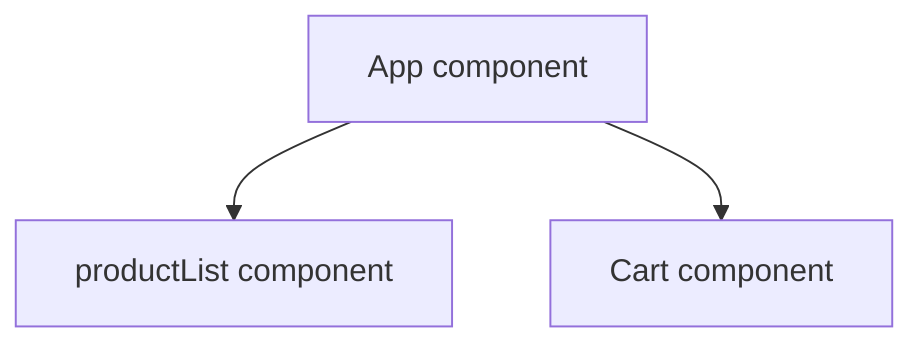
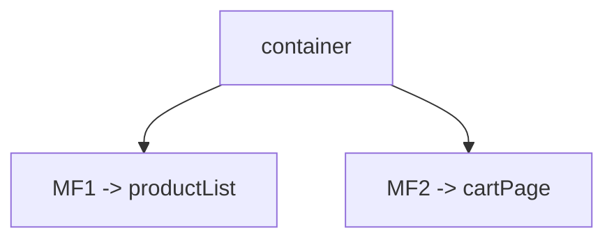
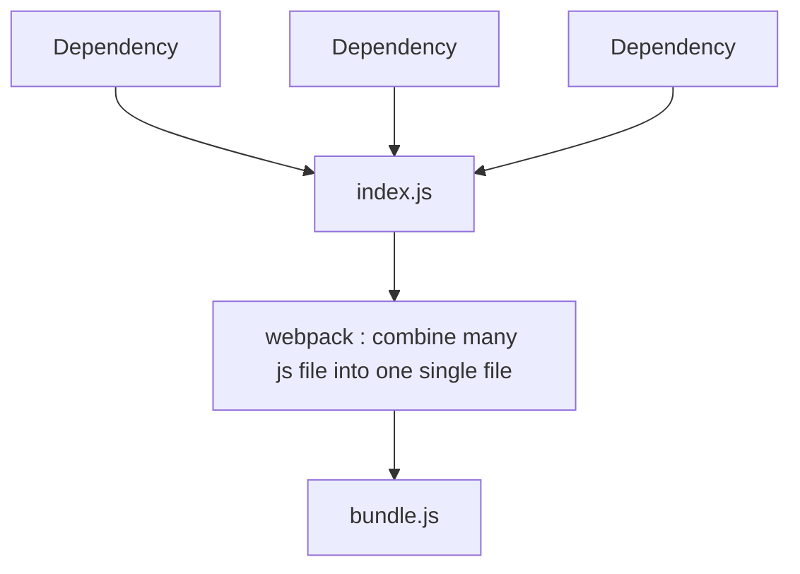
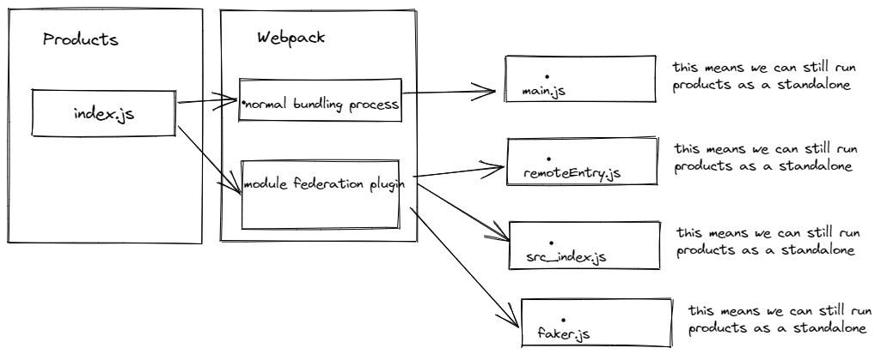

# Microfrontend-learning

This Repo Contains all my micro Frontend learning notes

## What is microfrontend

- consider we are building e com app with 2 pages : productlisting and shopping cart
- both pages need a lot of code so here we have 2 major feature and then we split both major feature in two totally different codebases
- this both can be built using any framework
- In microfrontent applications we always try to prevent direct communicatin between the different applications
- like here product listing page needs to share the details of products added to the shopping cart
- for this we need to use api and no direct communication.
- major reason for micronfrontend is that is keeps all the major features as different applications so different engineering team can work on that and they all can follow their best practices.
- different technical descisions can also be taken by different engineering team.

- so in microfrontnd we divide app into multiple , smaller apps
- each smaller apps is responsible for a distinct feature of the product

## why use them

- multiple engineering team can work in isolation
- each smaller app is easier to understand and make changes to
- if something breaks in one wont affect the other

## Dummy microfrontend app

- it would contain two pages i.e product listing and shopping cart
- 100% fake data
- first we think of monolithic style of something like this



- here this complete app ould be built with one framework.
- Now if we decide to built it using microfrontend then each major feature can be broken into different microfrontend application

- MF1 -> productList
- MF2 -> cartPage

- but to show which micro frontend on top we need to create one more microfrontend app called as **container** -> decides when and where to show all the microfrontends we have



- so finally we would make three smaller apps.

## Container application

- since container application needs to decide where to show and when to show so container needs to access these two application at some point in time.
- there are different ways of doing this.
- this process is reffered as **Integration**
- **Integration** :- how and when does the container get access to the source code in MFE

## Integration

- There is no single perfect solution to integration
- many solutions , each have pros and cons
- Look at what your requirement are , then pick a solution.

## Major Categories of integration

1. Build time integration ( compile time integration)

   - Before container gets loaded in the browser , it gets access to Product list source code

2. Run time integration ( Client side integration)

   - After container gets loaded in the browser , it gets access to the ProductList source code

3. Server integration
   - while sending down JS to load up Container , a server decides on weather or not to include ProductList source code

Note : searver integration requires tones of backend code.

## Build Time Integration

- All points goes down as the time increases

1. Engineering Team develops productList
2. Time to deploy!
3. Publish ProductList as an NPM package (npm registry)
4. team in charge of Container installs ProcuctList as a dependency
5. Container team builds their app
6. output bundle that includes all the code for productlist

- Easy to setup and understand
- Container has to be redeployed every time ProductList is updated
- Tempting to tightly couple the Container + ProductList together

## Run time integration

1. Engineering Team develops productList
2. Time to deploy!
3. ProductList code deployed at https://my-app.com/productlist.js (some static url)
4. user navigates to my-app.com , container app is loaded
5. container app fetches productlist.js and executes it

- product list can be deployed independently at any time
- different versions of product list can be deployed and container can decide which one to use
- Tooling + setup is far more complicated

## Here we would focus on run time integration using webpack module integration

## Project Structure ( project0)

1. container

```
📦container
 ┣ 📂public
 ┃ ┗ 📜index.html
 ┣ 📂src
 ┃ ┗ 📜index.js
 ┣ 📜package.json
 ┗ 📜webpack.config.js
```

2. cart

```
📦cart
 ┣ 📂public
 ┃ ┗ 📜index.html
 ┣ 📂src
 ┃ ┗ 📜index.js
 ┣ 📜package.json
 ┗ 📜webpack.config.js
```

3. products

```
📦products
 ┣ 📂public
 ┃ ┗ 📜index.html
 ┣ 📂src
 ┃ ┗ 📜index.js
 ┣ 📜package.json
 ┗ 📜webpack.config.js
```

- Each of these will be built using no framework
- we have to be able to run it in isolation
- we have to be able to run it through container app

Note: see project 01 folder



Now to make the webpack output easily visible we can use webpack dev server

- we setup both container and products project

- Now we need to setup our integration process

1. Design one app as the host(container) and one as the remote (products)
2. in the remote , decide which modules (files) you want to make available to other projects
   - right now its easy descision , i.e only src indes.js file
3. set up module fedaration plugin to expose those files

```
const HtmlWebpackPlugin = require('html-webpack-plugin');
const ModuleFederationPlugin = require('webpack/lib/container/ModuleFederationPlugin');

module.exports = {
  mode: 'development',
  devServer: {
    port: 8081,
  },
  plugins: [
    new ModuleFederationPlugin({
      name: 'products',
      filename: 'remoteEntry.js',
      exposes: {
        './ProductsIndex': './src/index',
      },
    }),
    new HtmlWebpackPlugin({
      template: './public/index.html',
    }),
  ],
};

```

4. in the host , decide which files you want to get from the remote

```
const HtmlWebpackPlugin = require('html-webpack-plugin');
const ModuleFederationPlugin = require('webpack/lib/container/ModuleFederationPlugin');

module.exports = {
  mode: 'development',
  devServer: {
    port: 8080,
  },
  plugins: [
    new ModuleFederationPlugin({
      name: 'container',
      remotes: {
        products: 'products@http://localhost:8081/remoteEntry.js',
      },
    }),
    new HtmlWebpackPlugin({
      template: './public/index.html',
    }),
  ],
};

```

5. set up module fedaration plugin to fetch those files
6. In the Host,refactor the entry point to load asynchronously
7. in the host , import whatever files you need from the remote

- All the code till here is added into project01 folder inside project 0 folder

if we go in the network tab we see




- image for reference
