# Microfrontend-learning

This Repo Contains all my micro Frontend learning notes

## What is microfrontend

- consider we are building e com app with 2 pages : productlisting and shopping cart
- both pages need a lot of code so here we have 2 major feature and then we split both major feature in two totally different codebases
- this both can be built using any framework
- In microfrontent applications we always try to prevent direct communicatin between the different applications
- like here product listing page needs to share the details of products added to the shopping cart
- for this we need to use api and no direct communication.
- major reason for micronfrontend is that is keeps all the major features as different applications so different engineering team can work on that and they all can follow their best practices.
- different technical descisions can also be taken by different engineering team.

- so in microfrontnd we divide app into multiple , smaller apps
- each smaller apps is responsible for a distinct feature of the product

## why use them

- multiple engineering team can work in isolation
- each smaller app is easier to understand and make changes to
- if something breaks in one wont affect the other

## Dummy microfrontend app

- it would contain two pages i.e product listing and shopping cart
- 100% fake data
- first we think of monolithic style of something like this

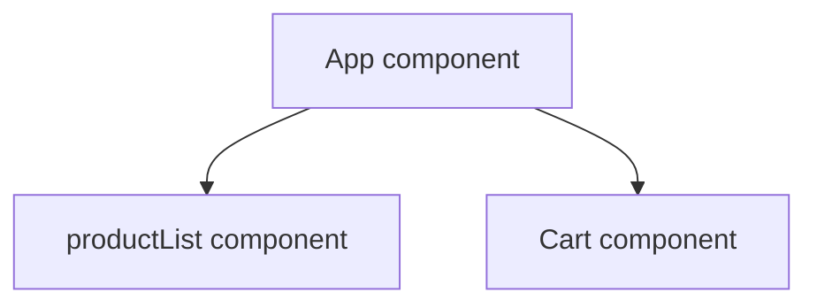
```mermaid
  graph TD;
      A[App component]-->B[productList component];
      A-->C[Cart component];
```

- here this complete app ould be built with one framework.
- Now if we decide to built it using microfrontend then each major feature can be broken into different microfrontend application

- MF1 -> productList
- MF2 -> cartPage

- but to show which micro frontend on top we need to create one more microfrontend app called as **container** -> decides when and where to show all the microfrontends we have

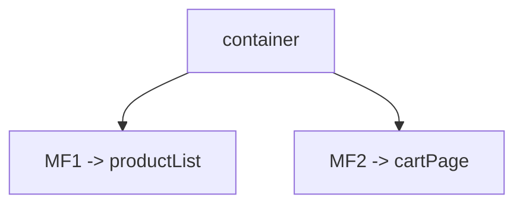
```mermaid
  graph TD;
      A[container]-->B[MF1 -> productList];
      A-->C[MF2 -> cartPage];
```

- so finally we would make three smaller apps.

## Container application

- since container application needs to decide where to show and when to show so container needs to access these two application at some point in time.
- there are different ways of doing this.
- this process is reffered as **Integration**
- **Integration** :- how and when does the container get access to the source code in MFE

## Integration

- There is no single perfect solution to integration
- many solutions , each have pros and cons
- Look at what your requirement are , then pick a solution.

## Major Categories of integration

1. Build time integration ( compile time integration)

   - Before container gets loaded in the browser , it gets access to Product list source code

2. Run time integration ( Client side integration)

   - After container gets loaded in the browser , it gets access to the ProductList source code

3. Server integration
   - while sending down JS to load up Container , a server decides on weather or not to include ProductList source code

Note : searver integration requires tones of backend code.

## Build Time Integration

- All points goes down as the time increases

1. Engineering Team develops productList
2. Time to deploy!
3. Publish ProductList as an NPM package (npm registry)
4. team in charge of Container installs ProcuctList as a dependency
5. Container team builds their app
6. output bundle that includes all the code for productlist

- Easy to setup and understand
- Container has to be redeployed every time ProductList is updated
- Tempting to tightly couple the Container + ProductList together

## Run time integration

1. Engineering Team develops productList
2. Time to deploy!
3. ProductList code deployed at https://my-app.com/productlist.js (some static url)
4. user navigates to my-app.com , container app is loaded
5. container app fetches productlist.js and executes it

- product list can be deployed independently at any time
- different versions of product list can be deployed and container can decide which one to use
- Tooling + setup is far more complicated

## Here we would focus on run time integration using webpack module integration

## Project Structure ( project0)

1. container

```
📦container
 ┣ 📂public
 ┃ ┗ 📜index.html
 ┣ 📂src
 ┃ ┗ 📜index.js
 ┣ 📜package.json
 ┗ 📜webpack.config.js
```

2. cart

```
📦cart
 ┣ 📂public
 ┃ ┗ 📜index.html
 ┣ 📂src
 ┃ ┗ 📜index.js
 ┣ 📜package.json
 ┗ 📜webpack.config.js
```

3. products

```
📦products
 ┣ 📂public
 ┃ ┗ 📜index.html
 ┣ 📂src
 ┃ ┗ 📜index.js
 ┣ 📜package.json
 ┗ 📜webpack.config.js
```

- Each of these will be built using no framework
- we have to be able to run it in isolation
- we have to be able to run it through container app

Note: see project 01 folder

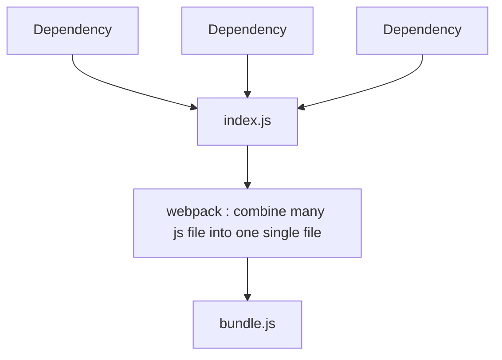
```mermaid
 graph TD;
     A[Dependency]-->D[index.js];
     B[Dependency]-->D[index.js];
     C[Dependency]-->D[index.js];
     D-->E[webpack : combine many js file into one single file];
     E-->F[bundle.js];
```

Now to make the webpack output easily visible we can use webpack dev server

- we setup both container and products project

- Now we need to setup our integration process

1. Design one app as the host(container) and one as the remote (products)
2. in the remote , decide which modules (files) you want to make available to other projects
   - right now its easy descision , i.e only src indes.js file
3. set up module fedaration plugin to expose those files

```
const HtmlWebpackPlugin = require('html-webpack-plugin');
const ModuleFederationPlugin = require('webpack/lib/container/ModuleFederationPlugin');

module.exports = {
  mode: 'development',
  devServer: {
    port: 8081,
  },
  plugins: [
    new ModuleFederationPlugin({
      name: 'products',
      filename: 'remoteEntry.js',
      exposes: {
        './ProductsIndex': './src/index',
      },
    }),
    new HtmlWebpackPlugin({
      template: './public/index.html',
    }),
  ],
};

```

4. in the host , decide which files you want to get from the remote

```
const HtmlWebpackPlugin = require('html-webpack-plugin');
const ModuleFederationPlugin = require('webpack/lib/container/ModuleFederationPlugin');

module.exports = {
  mode: 'development',
  devServer: {
    port: 8080,
  },
  plugins: [
    new ModuleFederationPlugin({
      name: 'container',
      remotes: {
        products: 'products@http://localhost:8081/remoteEntry.js',
      },
    }),
    new HtmlWebpackPlugin({
      template: './public/index.html',
    }),
  ],
};

```

5. set up module federation plugin to fetch those files
6. In the Host,refactor the entry point to load asynchronously
7. in the host , import whatever files you need from the remote

- All the code till here is added into project01 folder inside project 0 folder

if we go in the network tab we see


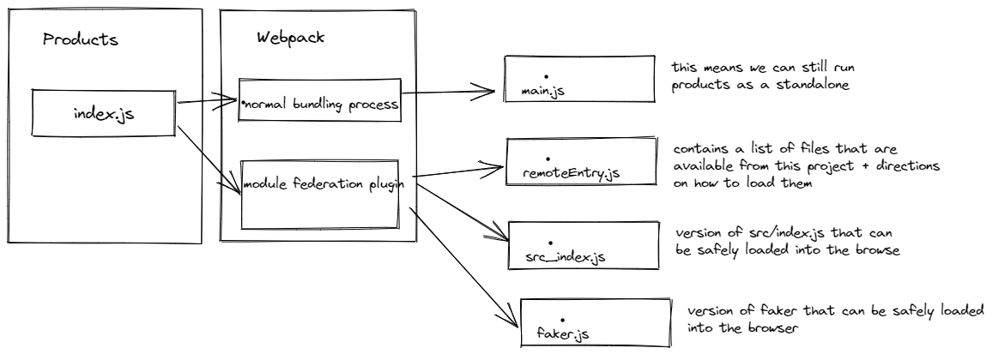

### Below is the container module federation

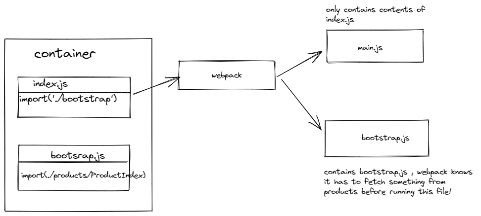

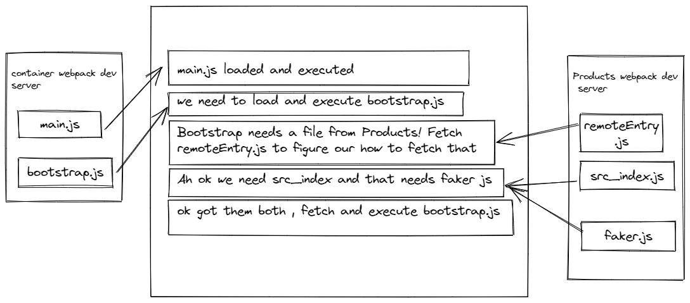

- the import statement gives webpack the opportunity to load up the code from Products before running bootstrap.js ... so we dont run bootstrap.js directly and import it in index.js

- lets understand the configuration options for container config file

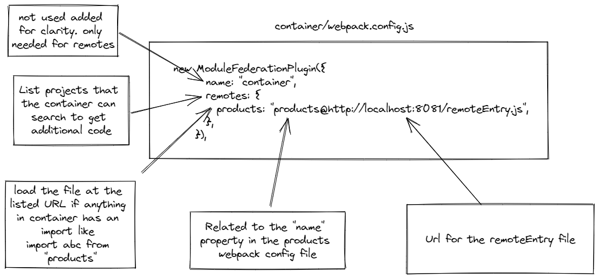

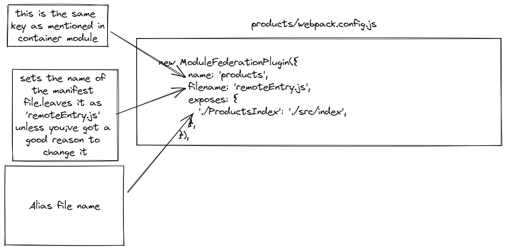

- similarly we will add the same to the cart application , webpack config of cart project

```
const HtmlWebpackPlugin = require("html-webpack-plugin");
const ModuleFederationPlugin = require("webpack/lib/container/ModuleFederationPlugin");

module.exports = {
  mode: "development",
  devServer: {
    port: 8082,
  },
  plugins: [
    new ModuleFederationPlugin({
      name: "cart",
      filename: "remoteEntry.js",
      exposes: {
        "./CartShow": "./src/index",
      },
    }),
    new HtmlWebpackPlugin({
      template: "./public/index.html",
    }),
  ],
};

```

- the final container app webpack config file will be

```
plugins: [
    new ModuleFederationPlugin({
      name: "container",
      remotes: {
        products: "products@http://localhost:8081/remoteEntry.js",
        cart: "cart@http://localhost:8082/remoteEntry.js",
      },
    }),
    new HtmlWebpackPlugin({
      template: "./public/index.html",
    }),
  ],
```

- Final Result of container app

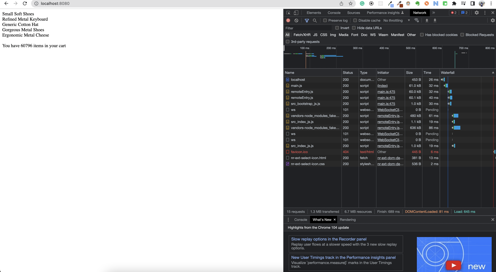

## Sharing dependency between MFS

- Here we can see in the above project we are loading faker module 2 times because for both cart and product faked module is loaded

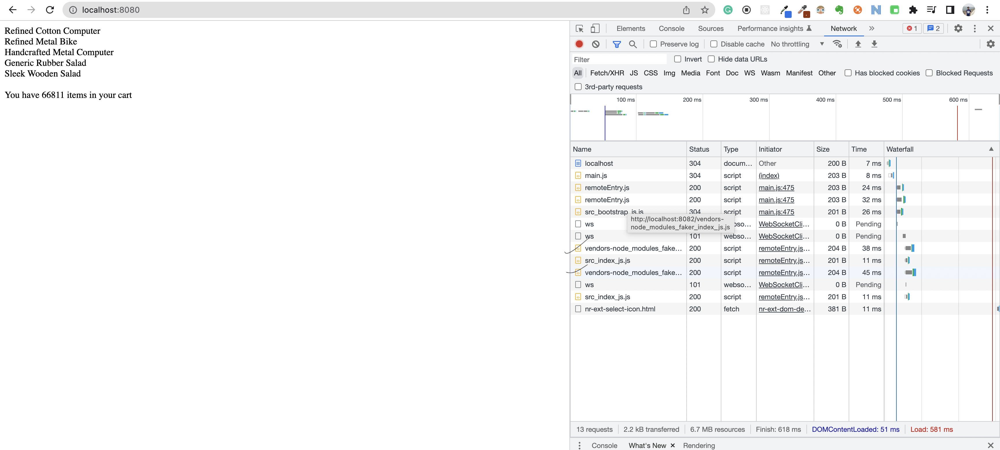

- we need to do something where both cart and product to use one copy of faker module.

- this can be done using module federation plugin

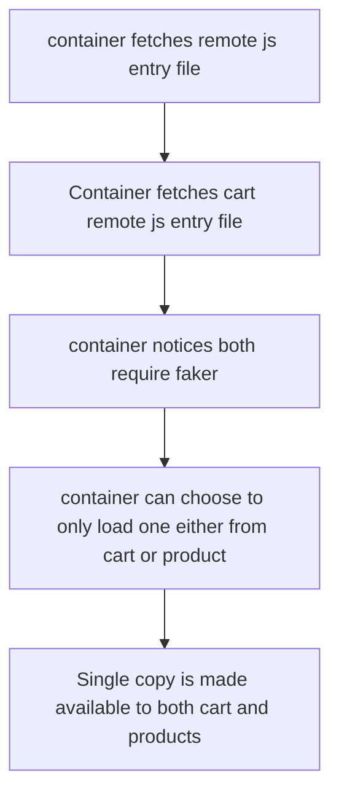
```mermaid
 graph TD;
     A[container fetches remote js entry file]-->B[Container fetches cart remote js entry file];
     B-->C[container notices both require faker];
     C-->D[container can choose to only load one either from cart or product];
     D-->E[Single copy is made available to both cart and products];
```

- Below is products webpack config js

```js
const HtmlWebpackPlugin = require("html-webpack-plugin");
const ModuleFederationPlugin = require("webpack/lib/container/ModuleFederationPlugin");

module.exports = {
  mode: "development",
  devServer: {
    port: 8081,
  },
  plugins: [
    new ModuleFederationPlugin({
      name: "products",
      filename: "remoteEntry.js",
      exposes: {
        "./ProductsIndex": "./src/index",
      },
      shared: ["faker"],
    }),
    new HtmlWebpackPlugin({
      template: "./public/index.html",
    }),
  ],
};
```

- we need to add `shared: ["faker"],` this to both cart and products webpack module federation plugin

- now in container application we will only see one faker module loaded

- we fixed this but we broke something as well , when we run cart or products alone it would give error now `Shared module is not available for eager consumption: `

- This is because now since faker is added to shared modules so when we run the app it first run `index.js` file which requires faker , but since its shared it loads it asynchronously , which in turn is not available at that moment

- to fix this we just need to create `bootstrap.js` file and move all the code from `index.js` to it , and in `index.js` add an import statement as below :

```js
// this way of importing tells webpack to load all the libraries async before running
import("./bootstrap");
```

- Now we can see that faker is only imported once in the container app

- **Note** :- There can also be a scenario where both project can make use of different version of faker.

- In this case it would import two different version of faker, which is expected behavior.

- Webpack also takes care of the npm versioning system , if there is not a major version change then in that case it would only download one copy of that

# Singleton Loading

- There are many libraries like (react) which we cannot load multiple times,which will gives error.

- So sometimes we may be using different versions of that library and in that case it would give error to use that library.

- So we need to force it to use only one copy of that particular version or at least get some warning , to do this we define shared modules with different syntax

```js
const HtmlWebpackPlugin = require("html-webpack-plugin");
const ModuleFederationPlugin = require("webpack/lib/container/ModuleFederationPlugin");

module.exports = {
  mode: "development",
  devServer: {
    port: 8081,
  },
  plugins: [
    new ModuleFederationPlugin({
      name: "products",
      filename: "remoteEntry.js",
      exposes: {
        "./ProductsIndex": "./src/index",
      },
      shared: ["faker"],
    }),
    new HtmlWebpackPlugin({
      template: "./public/index.html",
    }),
  ],
};
```

- update this in both cart and products.

- Now if we try to use different version of faker then it would use only one and give us a warning (`unsatisfied version`) in the browser console.

# Sub app execution context

- When we run products app in isolation then there it knows where to render (which element id to render all the list)
- But when we run the same app its not necessary that container would have the same div with same id.
- In this case container should have control over where to render any sub MF.

- Context/Situation #1
- We are running this file in development in isolation
- We are using our local index.html file
- Which DEFNITELY has an element with an id of 'dev-products
- We want to immediately render our app into that element

- Context/Situation #2
- We are running this file in develpment or production
- through the CONTAINER app
- NO GUARANTEE that an element with an id of 'dev-products' exists
- WE DO NOT WANT try to immediately render the app

```js
import faker from "faker";

const mount = (el) => {
  let products = "";

  for (let i = 0; i < 5; i++) {
    const name = faker.commerce.productName();
    products += `<div>${name}</div>`;
  }

  el.innerHTML = products;
};

// Context/Situation #1
// We are running this file in development in isolation
// We are using our local index.html file
// Which DEFNITELY has an element with an id of 'dev-products
// We want to immediately render our app into that element
if (process.env.NODE_ENV === "development") {
  const el = document.querySelector("#dev-products");

  // Assuming our container doesnt have an element
  // with id 'dev-products'....
  if (el) {
    // We are probably running in isolation
    mount(el);
  }
}

// Context/Situation #2
// We are running this file in develpment or production
// through the CONTAINER app
// NO GUARANTEE that an element with an id of 'dev-products' exists
// WE DO NOT WANT try to immediately render the app
export { mount };
```

- Now since this mount is exported from bootstrap file so we need to update the webpack file (exposes)

- Rather than exporting index now we would export bootstrap directly.

```js
const HtmlWebpackPlugin = require("html-webpack-plugin");
const ModuleFederationPlugin = require("webpack/lib/container/ModuleFederationPlugin");

module.exports = {
  mode: "development",
  devServer: {
    port: 8081,
  },
  plugins: [
    new ModuleFederationPlugin({
      name: "products",
      filename: "remoteEntry.js",
      exposes: {
        "./ProductsIndex": "./src/bootstrap",
      },
      shared: {
        faker: {
          singleton: true,
        },
      },
    }),
    new HtmlWebpackPlugin({
      template: "./public/index.html",
    }),
  ],
};
```

- In container we would import

```js
import { mount } from "products/ProductsIndex";
import "cart/CartShow";

console.log("Container!");

mount(document.querySelector("#my-products"));
```

- This can be used anywhere in react , vue , angular etc

- We would repeat the similar with cart app as well

# Application Two - A dummy SAAS project

- Home Page
- Pricing Page
- Sign In Page
- Sign In Page
- Sign Up Page
- Dashboard Page

## MFE to be divided in different projects

- Marketing :

  - Homepage
  - Pricing Page

- Authentication

  - Sign In
  - Sign Up

- Dashboard

  - Dashboard Page

- Container

## Tech Stack

- Container : React

- Marketing : React

- Authentication : React

- Dashboard : Vue

**Note : Integration technique is identical**

**Note**

- Some of the blog post or article may follow different approach

  - Share state between apps with redux
  - THe container must be written with web components
  - Only communicate between apps using xyz system
  - Each microfrontend can be a react component that is directly used by another app.

- The architecture of a project is defined by its requirements

- You need to think about the requirements of your app if this architecture works for you.

- There are wide verity of things you can do.

## Our Requirements

- Inflexible requirements #1

  - Zero coupling between child apps
    - No importing of functions/classes/ objects etc
    - No shared state
    - shared library through MF(module federation system) is ok

- Inflexible requirements #2

  - Near Zero coupling between container and child applications
    - Container should not assume that child is using a particular framework
    - Any necessary communication done with callbacks or simple events

- Inflexible requirements #3

  - Css From one project should not affect other (it should be scoped)

- Inflexible requirements #4

  - Version control (monorepo vs separate) shouldn't have any impact on the overall project
  - some people want to use mono repo
  - some people want to keep different repo

Note : for this we would use mono repo but it would be same for multi repo as well

- Inflexible requirements #5

  - Container should be able to decide to always use the latest version of microfrontend or specify a particular version
    - container will always use the latest version of a child app(doesn't require redeploy of container)
    - container can specify what version of child it wants to use (requires a redeploy to change )

## Project setup

- THe complete project will be in Project1(SAAS) folder and with a zip file also

- After extracting do `npm i` in all the 4 sub projects

- We are gonna create 3 webpack config files

  - One for production
  - one for dev
  - One common for dev and productions

- We will first start with **marketing**

- Webpack.common.js

```js
module.exports = {
  module: {
    rules: [
      {
        test: /\.(js|jsx)$/, // .js and .jsx files
        exclude: /node_modules/, // excluding the node_modules folder
        use: {
          loader: "babel-loader",
          options: {
            presets: ["@babel/preset-react", "@babel/preset-env"],
            plugins: ["@babel/plugin-transform-runtime"],
          },
        },
      },
    ],
  },
};
```

- webpack.dev.js

```js
const { merge } = require("webpack-merge");
const HtmlWebpackPlugin = require("html-webpack-plugin");
const commonConfig = require("./webpack.common");

const devConfig = {
  mode: "development",
  devServer: {
    port: 8081,
    historyApiFallback: {
      index: "index.html",
    },
  },
  plugins: [
    new HtmlWebpackPlugin({
      template: "./public/index.html",
    }),
  ],
};

module.exports = merge(commonConfig, devConfig);
```

- package.json

```json
{
  "name": "marketing",
  "version": "1.0.0",
  "scripts": {
    "start": "webpack serve --config config/webpack.dev.js"
  },
  "dependencies": {
    "@material-ui/core": "^4.11.0",
    "@material-ui/icons": "^4.9.1",
    "react": "^17.0.1",
    "react-dom": "^17.0.1",
    "react-router-dom": "^5.2.0"
  },
  "devDependencies": {
    "@babel/core": "^7.12.3",
    "@babel/plugin-transform-runtime": "^7.12.1",
    "@babel/preset-env": "^7.12.1",
    "@babel/preset-react": "^7.12.1",
    "babel-loader": "^8.1.0",
    "clean-webpack-plugin": "^3.0.0",
    "css-loader": "^5.0.0",
    "html-webpack-plugin": "^4.5.0",
    "style-loader": "^2.0.0",
    "webpack": "^5.4.0",
    "webpack-cli": "^4.1.0",
    "webpack-dev-server": "^3.11.0",
    "webpack-merge": "^5.2.0"
  }
}
```

- Note : In the previous commit(""Added marketing page"") we added all the code for marketing

## Container Application

- Now we would start to make the container application and also start to implement the module federation for both marketing and container application similar to last application

- Note we can directly export a component and not use mount , but here we are using a mount fn because we do not want to couple any framework with this .... as in future we may not use react for one app and use any other framework or library.

- Code used to call mount in react container application

```js
import { mount } from "marketing/MarketingApp";
import React, { useRef, useEffect } from "react";

export default () => {
  const ref = useRef(null);

  useEffect(() => {
    mount(ref.current);
  });

  return <div ref={ref} />;
};
```

Note : find the commit state with commit message "🔥Added container app and lined marketing to it"

- Now if we see then there is something wrong going with network tab , we are loading two copied or react library and also other libraries

- Lets add shared modules to webpack

Note : git commit message :"Added shared modules to webpack":

- Now sometimes there may be a lot of modules being shared and we need to add it manually

- so me may want sometimes to let webpack handle this(until we are not specific to some version/ specific to modules)

- Webpack dev config for container

```js
const { merge } = require("webpack-merge");
const HtmlWebpackPlugin = require("html-webpack-plugin");
const commonConfig = require("./webpack.common");
const ModuleFederationPlugin = require("webpack/lib/container/ModuleFederationPlugin");
const packageJson = require("../package.json");

const devConfig = {
  mode: "development",
  devServer: {
    port: 8080,
    historyApiFallback: {
      index: "index.html",
    },
  },
  plugins: [
    new ModuleFederationPlugin({
      name: "container",
      remotes: {
        marketing: "marketing@http://localhost:8081/remoteEntry.js",
      },
      shared: packageJson.dependencies,
    }),
    new HtmlWebpackPlugin({
      template: "./public/index.html",
    }),
  ],
};

module.exports = merge(commonConfig, devConfig);
```

- Webpack dev for marketing

```js
const { merge } = require("webpack-merge");
const HtmlWebpackPlugin = require("html-webpack-plugin");
const commonConfig = require("./webpack.common");
const ModuleFederationPlugin = require("webpack/lib/container/ModuleFederationPlugin");
const packageJson = require("../package.json");

const devConfig = {
  mode: "development",
  devServer: {
    port: 8081,
    historyApiFallback: {
      index: "index.html",
    },
  },
  plugins: [
    new ModuleFederationPlugin({
      name: "marketing",
      filename: "remoteEntry.js",
      exposes: {
        "./MarketingApp": "./src/bootstrap",
      },
      shared: packageJson.dependencies,
    }),
    new HtmlWebpackPlugin({
      template: "./public/index.html",
    }),
  ],
};

module.exports = merge(commonConfig, devConfig);
```

## Implementing CI/CD pipeline

- ### Deployment

  - want to deploy each microfrontend independently(including the container)
  - Location of child app remoteEntry.js file must be known at build time!
    - this is because everything on how to load child logic lies in the remoteEntry file.
    - There is no magic it would know , so we need to set it before (we need to add to webpack config file)
  - Many frontend deployment solutions assume you are deploying a single project - we need something that can handle multiple different ones

    - vercel(one single project)
    - now.sh(one single project)
    - heroku(one single project)
    - we need to find some solution to it

  - Probably need a CI/CD pipeline of some sort
  - At present , the remoteEntry.js file name is fixed! Need to think about caching issue

- For this project we would use monorepo

- **Note:THis will work identically if you decide to create a separate repo for each sub project**

- Git monorepo

  - Container
  - marketing
  - dashboard
  - auth

- Github

  - did container change? -> build production version of container with webpack -> upload the file to amazon s3
  - did marketing change? -> build production version of marketing with webpack -> upload the file to amazon s3
  - did dashboard change? -> build production version of dashboard with webpack -> upload the file to amazon s3
  - did auth change? -> build production version of auth with webpack -> upload the file to amazon s3

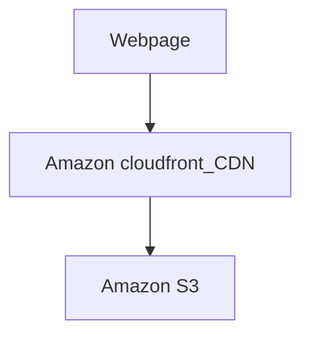
```mermaid
 graph TD;
     A[Webpage]-->B[Amazon cloudfront_CDN];
     B-->C[Amazon S3];
```

- ## Setup Github repo

  - we would be using this repo only
  - just update the git ignore file as we don't want to push dist and node modules folder there

- ## Setting up production configuration for webpack

  - container webpack.prod.js

```js
const { merge } = require("webpack-merge");

const commonConfig = require("./webpack.common");
const ModuleFederationPlugin = require("webpack/lib/container/ModuleFederationPlugin");
const packageJson = require("../package.json");

const domain = process.env.PRODUCTION_DOMAIN;

const prodConfig = {
  mode: "production",
  output: {
    filename: "[name].[contenthash].js",
  },
  plugins: [
    new ModuleFederationPlugin({
      name: "container",
      remotes: {
        marketing: `marketing@${domain}/marketing/remoteEntry.js`,
      },
      shared: packageJson.dependencies,
    }),
  ],
};

module.exports = merge(commonConfig, prodConfig);
```

- container webpack.common.js

```js
const HtmlWebpackPlugin = require("html-webpack-plugin");

module.exports = {
  module: {
    rules: [
      {
        test: /\.(js|jsx)$/, // .js and .jsx files
        exclude: /node_modules/, // excluding the node_modules folder
        use: {
          loader: "babel-loader",
          options: {
            presets: ["@babel/preset-react", "@babel/preset-env"],
            plugins: ["@babel/plugin-transform-runtime"],
          },
        },
      },
    ],
  },
  plugins: [
    new HtmlWebpackPlugin({
      template: "./public/index.html",
    }),
  ],
};
```

- Now we would move marketing app
  - marketing prod js

```js
const { merge } = require("webpack-merge");
const commonConfig = require("./webpack.common");
const ModuleFederationPlugin = require("webpack/lib/container/ModuleFederationPlugin");
const packageJson = require("../package.json");

const prodConfig = {
  mode: "production",
  output: {
    filename: "[name].[contenthash].js",
  },
  plugins: [
    new ModuleFederationPlugin({
      name: "marketing",
      filename: "remoteEntry.js",
      exposes: {
        "./MarketingApp": "./src/bootstrap",
      },
      shared: packageJson.dependencies,
    }),
  ],
};

module.exports = merge(commonConfig, prodConfig);
```

- Webpack common js

```js
module.exports = {
  module: {
    rules: [
      {
        test: /\.(js|jsx)$/, // .js and .jsx files
        exclude: /node_modules/, // excluding the node_modules folder
        use: {
          loader: "babel-loader",
          options: {
            presets: ["@babel/preset-react", "@babel/preset-env"],
            plugins: ["@babel/plugin-transform-runtime"],
          },
        },
      },
    ],
  },
};
```

## Setting Up CI/CD pipeline

- We would make use of github actions

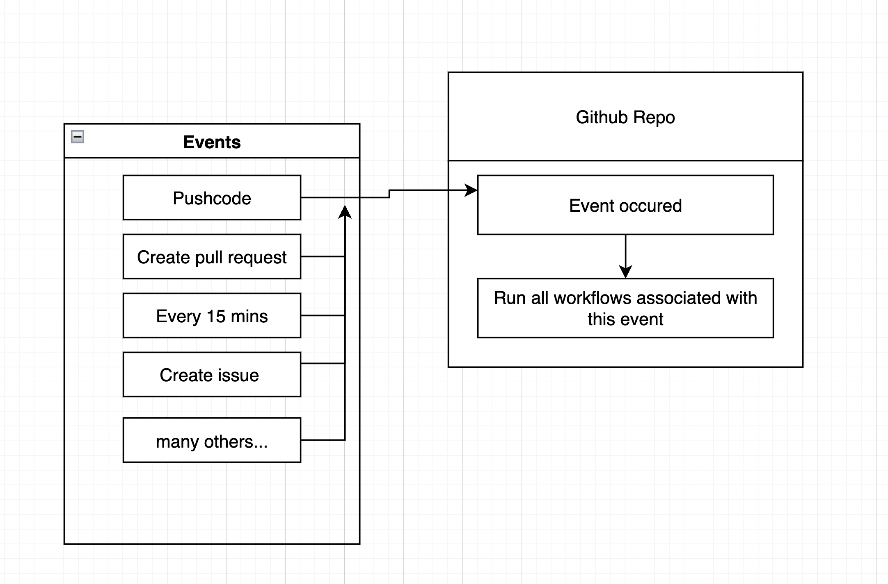

## Workflow for deploying container

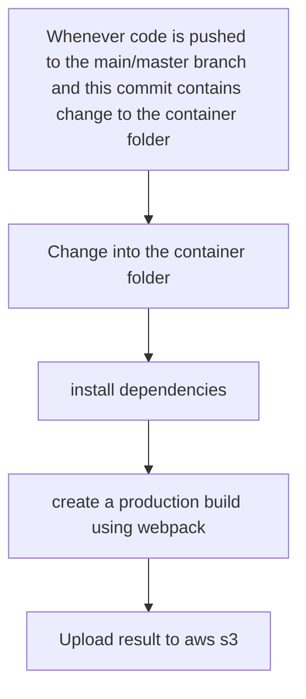
```mermaid
 graph TD;
     A[Whenever code is pushed to the main/master branch and this commit contains change to the container folder]-->B[Change into the container folder];
     B-->C[install dependencies];
     C-->D[create a production build using webpack]
     D-->E[Upload result to aws s3]
```

- Note : all these commands is executed in virtual machine hosted by github

- Now add the pipeline yml file for container

- container.yml file

```yml
name: deploy-container

on:
  push:
    branches:
      - main
    paths:
      - "Project1(saas)/packages/container/**"

defaults:
  run:
    working-directory: "Project1(saas)/packages/container"

jobs:
  build:
    runs-on: ubuntu-latest

    steps:
      - uses: actions/checkout@v3
      - run: npm install
      - run: npm run build

      - uses: shinyinc/action-aws-cli@v1.2
      - run: aws s3 sync dist s3://${{ secrets.AWS_S3_BUCKET_NAME }}/container/latest
        env:
          AWS_ACCESS_KEY_ID: ${{ secrets.AWS_ACCESS_KEY_ID }}
          AWS_SECRET_ACCESS_KEY: ${{ secrets.AWS_SECRET_ACCESS_KEY }}
          AWS_DEFAULT_REGION: ""
```

- Now setup you aws account and create a s3 bucket and make it public

- **S3 Bucket Creation and Configuration**

  - Go to AWS Management Console and use the search bar to find S3
  - Click Create Bucket
  - Specify an AWS Region
  - Provide unique Bucket Name and click Create Bucket
  - Click the new Bucket you have created from the Bucket list.
  - Select Properties
  - Scroll down to Static website hosting and click Edit
  - Change to Enable
  - Enter index.html in the Index document field
  - Click Save changes
  - Select Permissions
  - Click Edit in Block all public access
  - Untick the Block all public access box.
  - Click Save changes
  - Type confirm in the field and click Confirm
  - Find the Bucket Policy and click Edit
  - Click Policy generator
  - Change Policy type to S3 Bucket Policy
  - Set Principle to \*
  - Set Action to Get Object
  - Copy the S3 bucket ARN to add to the ARN field and add /\* to the end.
    - eg: arn:aws:s3:::mfe-dashboard/\*
  - Click Add Statement
  - Click generate policy
  - Copy paste the generated policy text to the Policy editor
  - Click Save changes

- **Cloudfront Setup**

  - Go to AWS Management Console and use the search bar to find CloudFront
  - Click Create distribution
  - Set Origin domain to your S3 bucket
  - Find the Default cache behavior section and change Viewer protocol policy to Redirect HTTP to HTTPS
  - Scroll down and click Create Distribution
  - After Distribution creation has finalized click the Distribution from the list, find its Settings and click Edit
  - Scroll down to find the Default root object field and enter /container/latest/index.html
  - Click Save changes
  - Click Error pages
  - Click Create custom error response
  - Change HTTP error code to 403: Forbidden
  - Change Customize error response to Yes
  - Set Response page path to /container/latest/index.html
  - Set HTTP Response Code to 200: OK

- **Create IAM user**

  - Go to AWS Management Console and use the search bar to find IAM
  - In IAM dashboard, click Users in the left sidebar
  - Click Add Users
  - Enter a unique name in the User name field
  - In Select AWS credential type tick Access Key - Programmatic access
  - Click Next: Permissions
  - Select Attach existing policies directly
  - Use search bar to find and tick AmazonS3FullAccess and CloudFrontFullAccess
  - Click Next: Tags
  - Click Next: Review
  - Click Create user

- We also need to update the container yml file with AWS default region

example is below

```yml
- uses: shinyinc/action-aws-cli@v1.2
- run: aws s3 sync dist s3://${{ secrets.AWS_S3_BUCKET_NAME }}/container/latest
  env:
    AWS_ACCESS_KEY_ID: ${{ secrets.AWS_ACCESS_KEY_ID }}
    AWS_SECRET_ACCESS_KEY: ${{ secrets.AWS_SECRET_ACCESS_KEY }}
    AWS_DEFAULT_REGION: ap-south-1
```

- Now add these secret keys in github secrets

  - AWS_ACCESS_KEY_ID
  - AWS_SECRET_ACCESS_KEY
  - AWS_S3_BUCKET_NAME

- Now we are good to do and test the build

- Meanwhile we also setup the marketing app

  - check webpack config and also marketing workflow for reference

- Now if we open the url for cloudfront we could see our app working perfectly fine

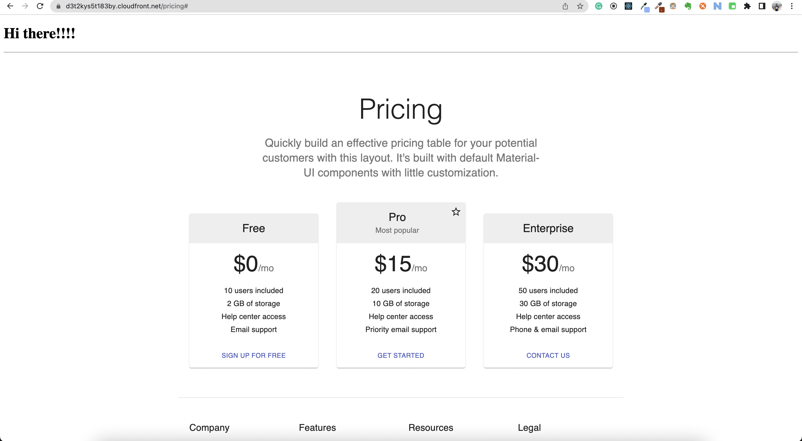

## Handling CSS in microfrontend

- have added an Header component in container application

```js
import React from "react";
import { BrowserRouter } from "react-router-dom";
import Header from "./components/Header";
import MarketingApp from "./components/MarketingApp";

export default () => {
  return (
    <BrowserRouter>
      <div>
        <Header />
        <MarketingApp />
      </div>
    </BrowserRouter>
  );
};
```

- Below is the local screenshot of the container app with header

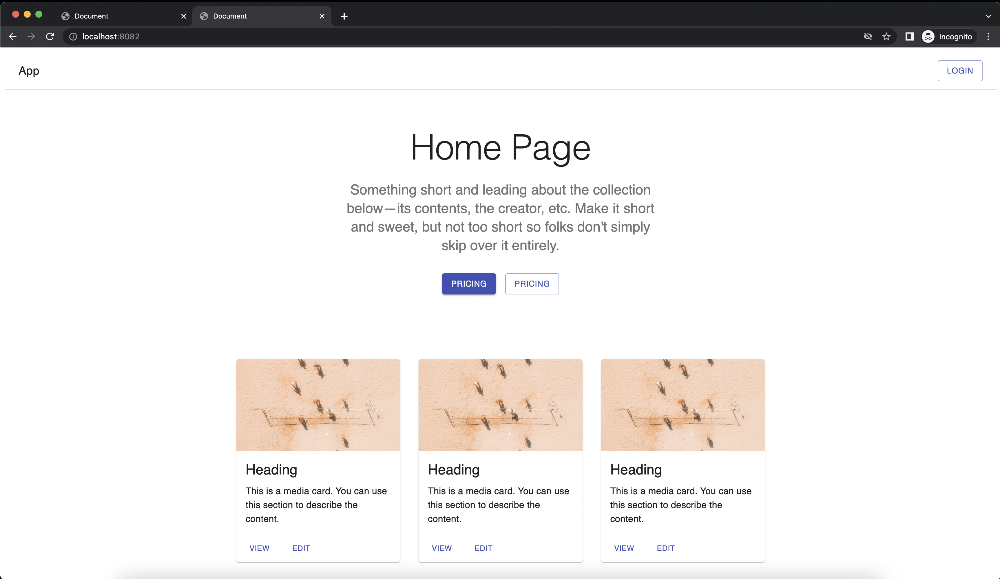

- Below we can find the production application screenshot

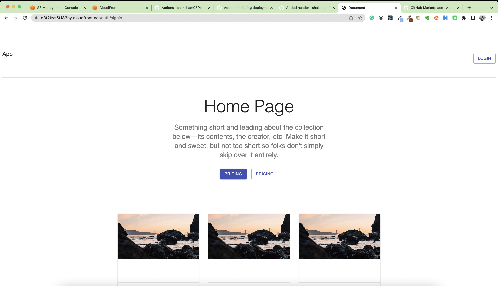

- Here we can see somehow the styling of the header and images are broken completely

- There is much deeper issue going on here

- Below diagram helps us understand the CSS issue better

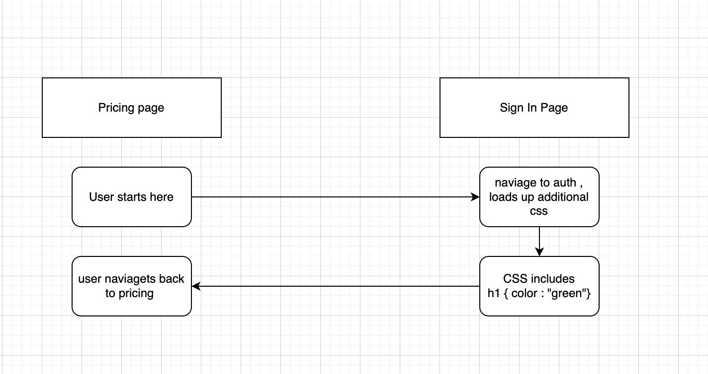

## CSS scoping solutions

- Custom CSS you are writing for your project

  - USe a CSS in JS library
    - adds class with specific ids
  - Use Vue's built in component style scoping
  - use angular's built in component style scoping
  - Namespace all your CSS

- CSS coming from a component library or css library(bootstrap)
  - Use a component library that does css in js
  - Manually bind the css library and apply framespacing techniques to it

## Understanding css in js libraries (we are using material ui which uses this )

- 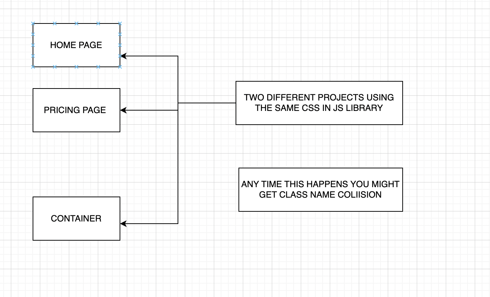

- 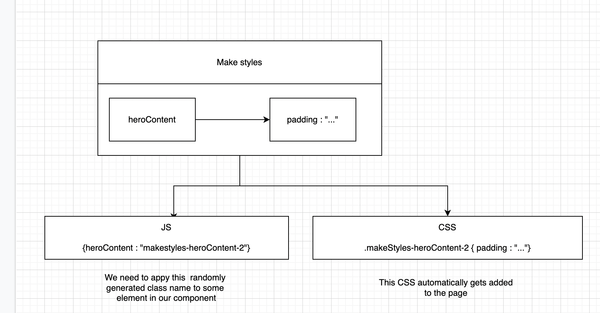

- Now in production what happens is

- 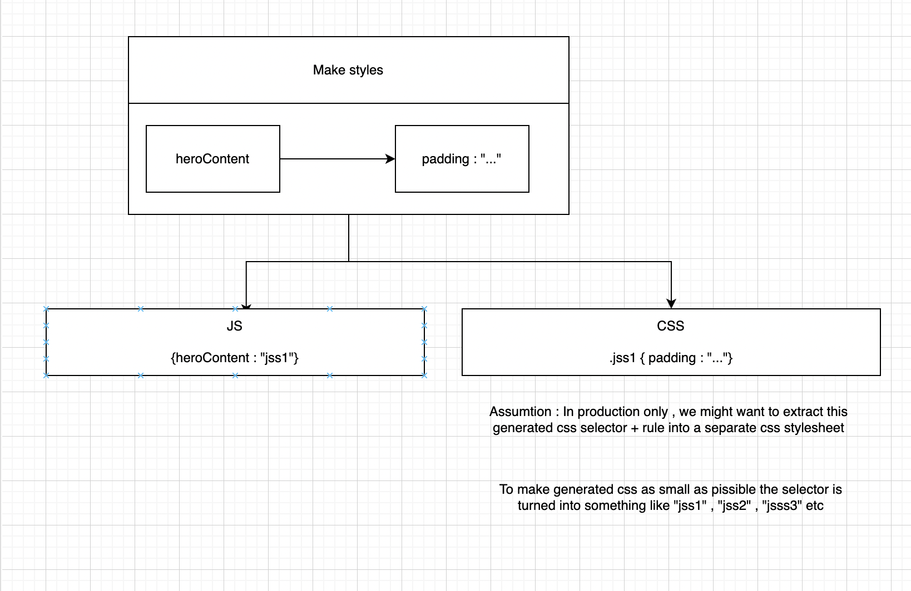

- 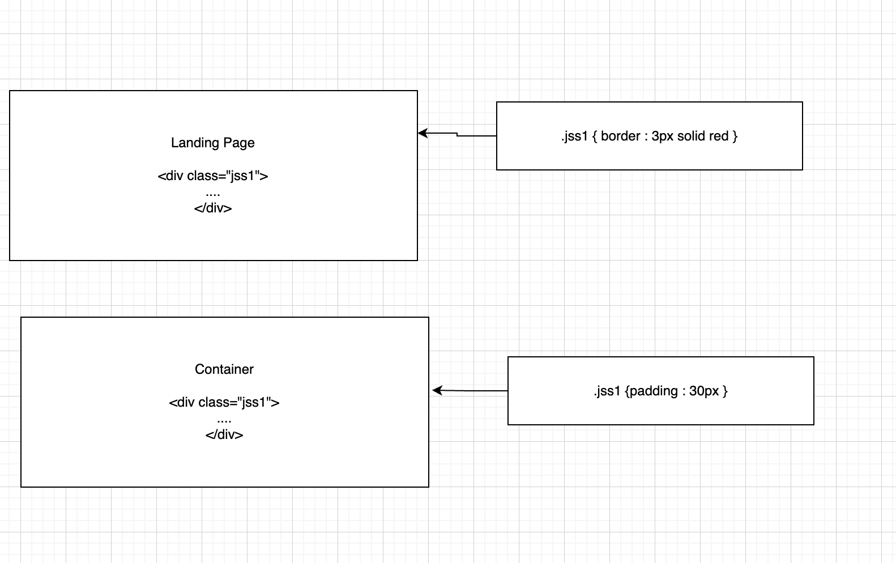

- Now we need to make sure generated class name for different project is very different

- marketing app js

- we would use generate class name and add different prefix

```js
import React from "react";
import { Switch, Route, BrowserRouter } from "react-router-dom";
import {
  StylesProvider,
  createGenerateClassName,
} from "@material-ui/core/styles";

import Landing from "./components/Landing";
import Pricing from "./components/Pricing";

const generateClassName = createGenerateClassName({
  productionPrefix: "ma",
});

export default () => {
  return (
    <div>
      <StylesProvider generateClassName={generateClassName}>
        <BrowserRouter>
          <Switch>
            <Route exact path="/pricing" component={Pricing} />
            <Route path="/" component={Landing} />
          </Switch>
        </BrowserRouter>
      </StylesProvider>
    </div>
  );
};
```

- similarly we would do for container app

```js
import React from "react";
import { BrowserRouter } from "react-router-dom";
import Header from "./components/Header";
import MarketingApp from "./components/MarketingApp";
import {
  StylesProvider,
  createGenerateClassName,
} from "@material-ui/core/styles";

const generateClassName = createGenerateClassName({
  productionPrefix: "co",
});

export default () => {
  return (
    <BrowserRouter>
      <StylesProvider generateClassName={generateClassName}>
        <div>
          <Header />
          <MarketingApp />
        </div>
      </StylesProvider>
    </BrowserRouter>
  );
};
```

- things can be different for other css based libraries (make sure to handle this)

## Small Required Change to historyApiFallback

- Before starting on the next section, we will need to fix up a bug related to the historyApiFallback settings. Otherwise, you will be met with 404 errors in certain situations such as directly accessing http://localhost:8081/pricing.

- Find this code in the webpack/dev.js file in both marketing and the container:

```js
  devServer: {
    port: 8082,
    historyApiFallback: {
      index: "index.html",
    },
  },
```

- You may resolve the issue by adding a / to the front of index.html:

```js
devServer: {
    port: 8082,
    historyApiFallback: {
      index: "/index.html",
    },
  },
```

- Or, by setting to true:

```js
devServer: {
    port: 8082,
    historyApiFallback: true,
  },
```

- After making this change, remember to restart both of your servers.

## Inflexible requirements of navigation

- Right now in production the navigation is broken , if we go to pricing page and again try to go back to homepage then the url updates but we dont see the content properly

- Inflexible Requirements #1

  - Both the container + individual sub apps need routing features
    - users can navigate around to different sub apps using routing logic built into the container
    - users can navigate around in a subapp using routing logic built into the subapp itself
    - not all subapps will require routing

- Inflexible Requirements #2

  - Sub apps might need to add in new pages / routes all the time
    - new routes added to a subapp shouldnt require a redeploy of the container!

- Inflexible Requirements #3

  - We might need to show two or more microfrontend at the same time
    - this will occur all the time if we have some kind of sidebar nav that is built as a separate microfrontend

- Inflexible Requirements #4

  - We want to use off the shelf routing solutions
    - Building a routing library can be hard - we dont want to author a new one!
    - Some amount of custom coding is ok

- Inflexible Requirements #5

  - We need navigation features for sub apps in both hosted mode and in isolation
    - developing for each environment should be easy - a developer should immediately be able to see what path they are viewing

- Inflexible Requirements #6
  - If different apps need to communicate information about routing , it should be done in as generic a fashion as possible
    - each app might be using a completely different navigation framework
    - we might swap out or upgrade navigation libraries all the time - shouldn't require a rewrite of the rest of the app

## A few solution for above 6 requirements

1. both the container + individual sub apps needs routing feature

- 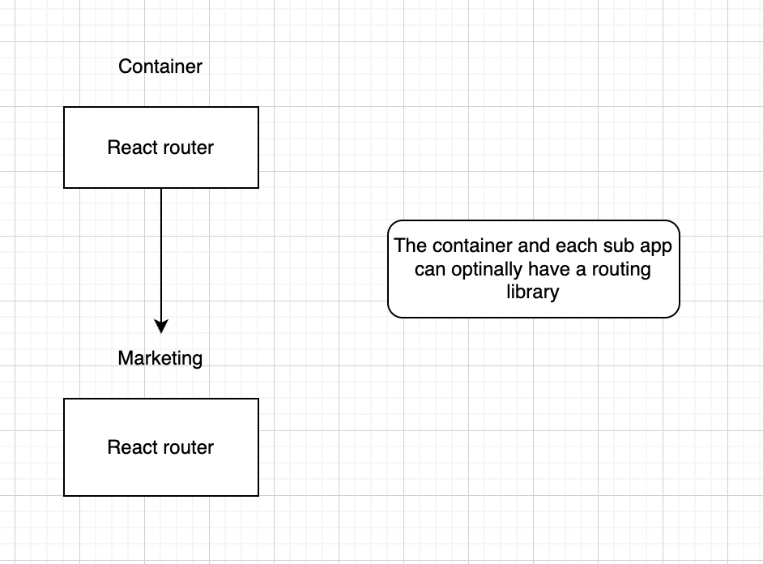

- this both app can have its own copy of react router

2. sub apps might need to add in new pages/routes all the time

- 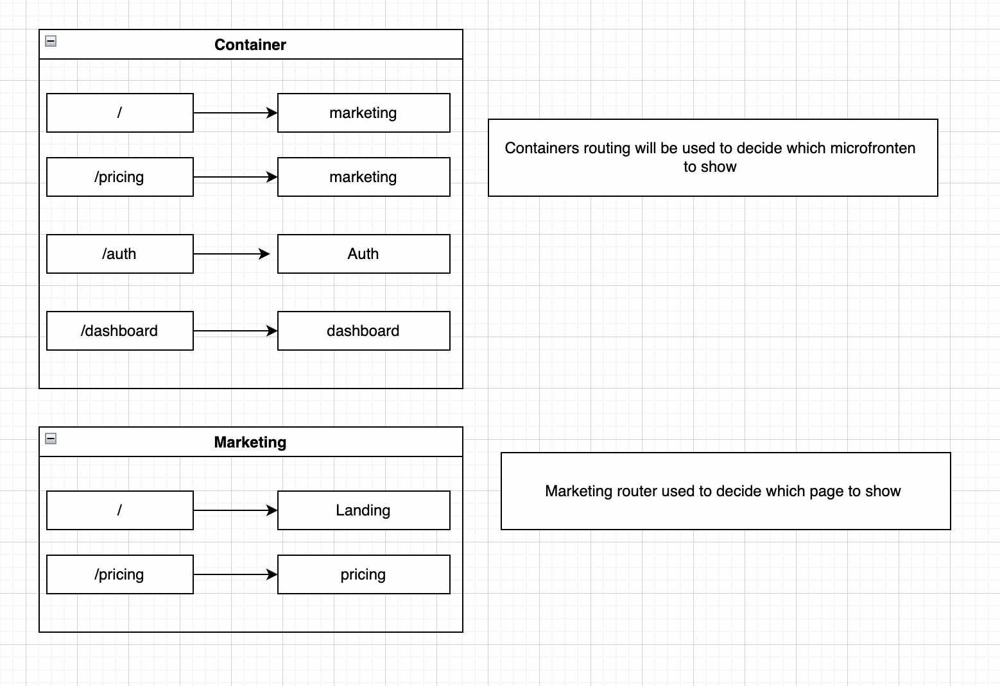

3. we might need to show two or more microfrontends at the same time

- 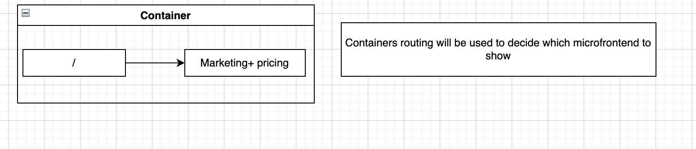

4. we want to use off the shelf routing solutions

5. we need navigation features for sub-apps in both hosted mode and in isolation

6. in different apps need to communicate information about routing , it should be done in as generic as fashion as possible

**FIrst three was easy but for last three we need to have more information before we can find the solution**

- Routing libraries decide what content to show on the screen

- 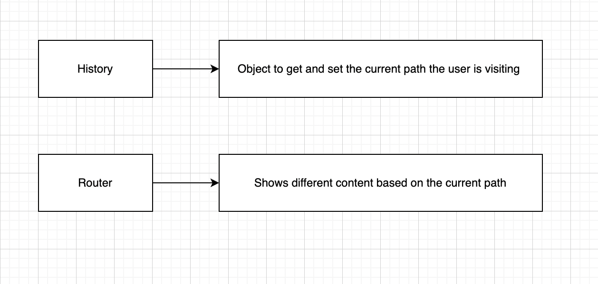

- All there routing libraries generally maintain 3 different kinds of history objects

  - Here different kinds means what route a user is currently visiting.
  - this first one is **Browser History** -> look at the path portion of the URL (everything after the domain) to figure out what the current path is.
  - eg http://app.com/marketing/pricing -> everything after domain is _marketing/pricing_
  - Another type of history is called **hash history** -> look at everything after the '#' in the URL to figure out the current path
  - Another kind of history object **Memory/Abstract history** -> keep track of current path in the memory
    - this does not uses url/address in any way to figure out where the user is.

- So what this all have to do with our app
- Remember we have set that our app will have multi tier navigation support

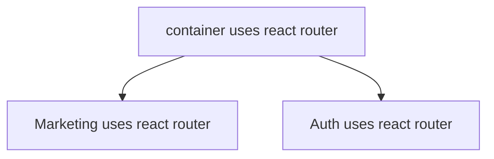
```mermaid
 graph TD;
    A[container uses react router]-->B[Marketing uses react router];
    A-->C[Auth uses react router];
```

- Here the each copy of react router is completely 100% separate(different routing library or even version)
- The best way to handle routes is

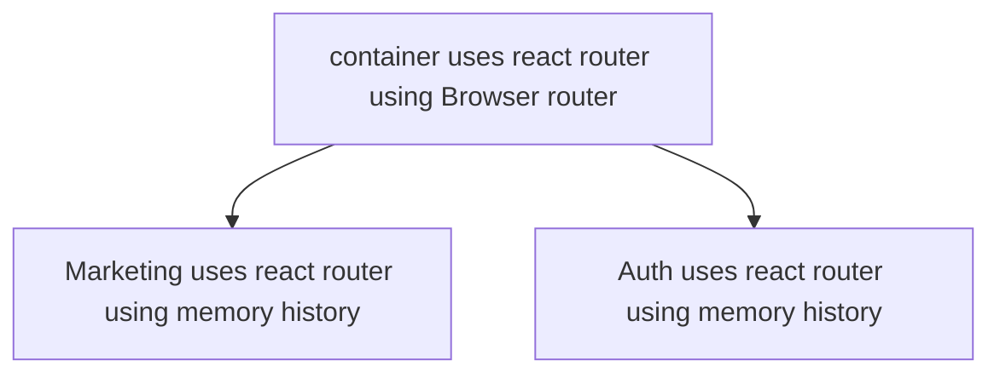
```mermaid
 graph TD;
    A[container uses react router using Browser router]-->B[Marketing uses react router using memory history];
    A-->C[Auth uses react router using memory history];
```

graph TD;
A[container]-->B[MF1 -> productList];
A-->C[MF2 -> cartPage];
