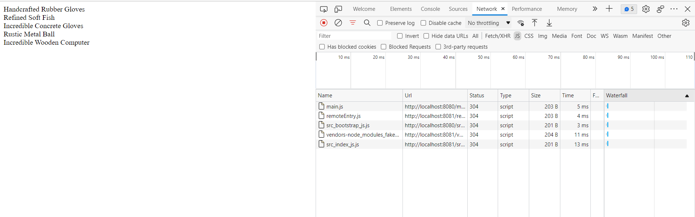

# Microfrontend-learning

This Repo Contains all my micro Frontend learning notes

## What is microfrontend

- consider we are building e com app with 2 pages : productlisting and shopping cart
- both pages need a lot of code so here we have 2 major feature and then we split both major feature in two totally different codebases
- this both can be built using any framework
- In microfrontent applications we always try to prevent direct communicatin between the different applications
- like here product listing page needs to share the details of products added to the shopping cart
- for this we need to use api and no direct communication.
- major reason for micronfrontend is that is keeps all the major features as different applications so different engineering team can work on that and they all can follow their best practices.
- different technical descisions can also be taken by different engineering team.

- so in microfrontnd we divide app into multiple , smaller apps
- each smaller apps is responsible for a distinct feature of the product

## why use them

- multiple engineering team can work in isolation
- each smaller app is easier to understand and make changes to
- if something breaks in one wont affect the other

## Dummy microfrontend app

- it would contain two pages i.e product listing and shopping cart
- 100% fake data
- first we think of monolithic style of something like this


- here this complete app ould be built with one framework.
- Now if we decide to built it using microfrontend then each major feature can be broken into different microfrontend application

- MF1 -> productList
- MF2 -> cartPage

- but to show which micro frontend on top we need to create one more microfrontend app called as **container** -> decides when and where to show all the microfrontends we have


- so finally we would make three smaller apps.

## Container application

- since container application needs to decide where to show and when to show so container needs to access these two application at some point in time.
- there are different ways of doing this.
- this process is reffered as **Integration**
- **Integration** :- how and when does the container get access to the source code in MFE

## Integration

- There is no single perfect solution to integration
- many solutions , each have pros and cons
- Look at what your requirement are , then pick a solution.

## Major Categories of integration

1. Build time integration ( compile time integration)

   - Before container gets loaded in the browser , it gets access to Product list source code

2. Run time integration ( Client side integration)

   - After container gets loaded in the browser , it gets access to the ProductList source code

3. Server integration
   - while sending down JS to load up Container , a server decides on weather or not to include ProductList source code

Note : searver integration requires tones of backend code.

## Build Time Integration

- All points goes down as the time increases

1. Engineering Team develops productList
2. Time to deploy!
3. Publish ProductList as an NPM package (npm registry)
4. team in charge of Container installs ProcuctList as a dependency
5. Container team builds their app
6. output bundle that includes all the code for productlist

- Easy to setup and understand
- Container has to be redeployed every time ProductList is updated
- Tempting to tightly couple the Container + ProductList together

## Run time integration

1. Engineering Team develops productList
2. Time to deploy!
3. ProductList code deployed at https://my-app.com/productlist.js (some static url)
4. user navigates to my-app.com , container app is loaded
5. container app fetches productlist.js and executes it

- product list can be deployed independently at any time
- different versions of product list can be deployed and container can decide which one to use
- Tooling + setup is far more complicated

## Here we would focus on run time integration using webpack module integration

## Project Structure ( project0)

1. container

```
📦container
 ┣ 📂public
 ┃ ┗ 📜index.html
 ┣ 📂src
 ┃ ┗ 📜index.js
 ┣ 📜package.json
 ┗ 📜webpack.config.js
```

2. cart

```
📦cart
 ┣ 📂public
 ┃ ┗ 📜index.html
 ┣ 📂src
 ┃ ┗ 📜index.js
 ┣ 📜package.json
 ┗ 📜webpack.config.js
```

3. products

```
📦products
 ┣ 📂public
 ┃ ┗ 📜index.html
 ┣ 📂src
 ┃ ┗ 📜index.js
 ┣ 📜package.json
 ┗ 📜webpack.config.js
```

- Each of these will be built using no framework
- we have to be able to run it in isolation
- we have to be able to run it through container app

Note: see project 01 folder


Now to make the webpack output easily visible we can use webpack dev server

- we setup both container and products project

- Now we need to setup our integration process

1. Design one app as the host(container) and one as the remote (products)
2. in the remote , decide which modules (files) you want to make available to other projects
   - right now its easy descision , i.e only src indes.js file
3. set up module fedaration plugin to expose those files

```
const HtmlWebpackPlugin = require('html-webpack-plugin');
const ModuleFederationPlugin = require('webpack/lib/container/ModuleFederationPlugin');

module.exports = {
  mode: 'development',
  devServer: {
    port: 8081,
  },
  plugins: [
    new ModuleFederationPlugin({
      name: 'products',
      filename: 'remoteEntry.js',
      exposes: {
        './ProductsIndex': './src/index',
      },
    }),
    new HtmlWebpackPlugin({
      template: './public/index.html',
    }),
  ],
};

```

4. in the host , decide which files you want to get from the remote

```
const HtmlWebpackPlugin = require('html-webpack-plugin');
const ModuleFederationPlugin = require('webpack/lib/container/ModuleFederationPlugin');

module.exports = {
  mode: 'development',
  devServer: {
    port: 8080,
  },
  plugins: [
    new ModuleFederationPlugin({
      name: 'container',
      remotes: {
        products: 'products@http://localhost:8081/remoteEntry.js',
      },
    }),
    new HtmlWebpackPlugin({
      template: './public/index.html',
    }),
  ],
};

```

5. set up module federation plugin to fetch those files
6. In the Host,refactor the entry point to load asynchronously
7. in the host , import whatever files you need from the remote

- All the code till here is added into project01 folder inside project 0 folder

if we go in the network tab we see




### Below is the container module federation


- the import statement gives webpack the opportunity to load up the code from Products before running bootstrap.js ... so we dont run bootstrap.js directly and import it in index.js

- lets understand the configuration options for container config file


- similarly we will add the same to the cart application , webpack config of cart project

```
const HtmlWebpackPlugin = require("html-webpack-plugin");
const ModuleFederationPlugin = require("webpack/lib/container/ModuleFederationPlugin");

module.exports = {
  mode: "development",
  devServer: {
    port: 8082,
  },
  plugins: [
    new ModuleFederationPlugin({
      name: "cart",
      filename: "remoteEntry.js",
      exposes: {
        "./CartShow": "./src/index",
      },
    }),
    new HtmlWebpackPlugin({
      template: "./public/index.html",
    }),
  ],
};

```

- the final container app webpack config file will be

```
plugins: [
    new ModuleFederationPlugin({
      name: "container",
      remotes: {
        products: "products@http://localhost:8081/remoteEntry.js",
        cart: "cart@http://localhost:8082/remoteEntry.js",
      },
    }),
    new HtmlWebpackPlugin({
      template: "./public/index.html",
    }),
  ],
```

- Final Result of container app


## Sharing dependency between MFS

- Here we can see in the above project we are loading faker module 2 times because for both cart and product faked module is loaded


- we need to do something where both cart and product to use one copy of faker module.

- this can be done using module federation plugin


- Below is products webpack config js

```js
const HtmlWebpackPlugin = require("html-webpack-plugin");
const ModuleFederationPlugin = require("webpack/lib/container/ModuleFederationPlugin");

module.exports = {
  mode: "development",
  devServer: {
    port: 8081,
  },
  plugins: [
    new ModuleFederationPlugin({
      name: "products",
      filename: "remoteEntry.js",
      exposes: {
        "./ProductsIndex": "./src/index",
      },
      shared: ["faker"],
    }),
    new HtmlWebpackPlugin({
      template: "./public/index.html",
    }),
  ],
};
```

- we need to add `shared: ["faker"],` this to both cart and products webpack module federation plugin

- now in container application we will only see one faker module loaded

- we fixed this but we broke something as well , when we run cart or products alone it would give error now `Shared module is not available for eager consumption: `

- This is because now since faker is added to shared modules so when we run the app it first run `index.js` file which requires faker , but since its shared it loads it asynchronously , which in turn is not available at that moment

- to fix this we just need to create `bootstrap.js` file and move all the code from `index.js` to it , and in `index.js` add an import statement as below :

```js
// this way of importing tells webpack to load all the libraries async before running
import("./bootstrap");
```

- Now we can see that faker is only imported once in the container app

- **Note** :- There can also be a scenario where both project can make use of different version of faker.

- In this case it would import two different version of faker, which is expected behavior.

- Webpack also takes care of the npm versioning system , if there is not a major version change then in that case it would only download one copy of that

# Singleton Loading

- There are many libraries like (react) which we cannot load multiple times,which will gives error.

- So sometimes we may be using different versions of that library and in that case it would give error to use that library.

- So we need to force it to use only one copy of that particular version or at least get some warning , to do this we define shared modules with different syntax

```js
const HtmlWebpackPlugin = require("html-webpack-plugin");
const ModuleFederationPlugin = require("webpack/lib/container/ModuleFederationPlugin");

module.exports = {
  mode: "development",
  devServer: {
    port: 8081,
  },
  plugins: [
    new ModuleFederationPlugin({
      name: "products",
      filename: "remoteEntry.js",
      exposes: {
        "./ProductsIndex": "./src/index",
      },
      shared: ["faker"],
    }),
    new HtmlWebpackPlugin({
      template: "./public/index.html",
    }),
  ],
};
```

- update this in both cart and products.

- Now if we try to use different version of faker then it would use only one and give us a warning (`unsatisfied version`) in the browser console.

# Sub app execution context

- When we run products app in isolation then there it knows where to render (which element id to render all the list)
- But when we run the same app its not necessary that container would have the same div with same id.
- In this case container should have control over where to render any sub MF.

- Context/Situation #1
- We are running this file in development in isolation
- We are using our local index.html file
- Which DEFNITELY has an element with an id of 'dev-products
- We want to immediately render our app into that element

- Context/Situation #2
- We are running this file in develpment or production
- through the CONTAINER app
- NO GUARANTEE that an element with an id of 'dev-products' exists
- WE DO NOT WANT try to immediately render the app

```js
import faker from "faker";

const mount = (el) => {
  let products = "";

  for (let i = 0; i < 5; i++) {
    const name = faker.commerce.productName();
    products += `<div>${name}</div>`;
  }

  el.innerHTML = products;
};

// Context/Situation #1
// We are running this file in development in isolation
// We are using our local index.html file
// Which DEFNITELY has an element with an id of 'dev-products
// We want to immediately render our app into that element
if (process.env.NODE_ENV === "development") {
  const el = document.querySelector("#dev-products");

  // Assuming our container doesnt have an element
  // with id 'dev-products'....
  if (el) {
    // We are probably running in isolation
    mount(el);
  }
}

// Context/Situation #2
// We are running this file in develpment or production
// through the CONTAINER app
// NO GUARANTEE that an element with an id of 'dev-products' exists
// WE DO NOT WANT try to immediately render the app
export { mount };
```

- Now since this mount is exported from bootstrap file so we need to update the webpack file (exposes)

- Rather than exporting index now we would export bootstrap directly.

```js
const HtmlWebpackPlugin = require("html-webpack-plugin");
const ModuleFederationPlugin = require("webpack/lib/container/ModuleFederationPlugin");

module.exports = {
  mode: "development",
  devServer: {
    port: 8081,
  },
  plugins: [
    new ModuleFederationPlugin({
      name: "products",
      filename: "remoteEntry.js",
      exposes: {
        "./ProductsIndex": "./src/bootstrap",
      },
      shared: {
        faker: {
          singleton: true,
        },
      },
    }),
    new HtmlWebpackPlugin({
      template: "./public/index.html",
    }),
  ],
};
```

- In container we would import

```js
import { mount } from "products/ProductsIndex";
import "cart/CartShow";

console.log("Container!");

mount(document.querySelector("#my-products"));
```

- This can be used anywhere in react , vue , angular etc

- We would repeat the similar with cart app as well

# Application Two - A dummy SAAS project

- Home Page
- Pricing Page
- Sign In Page
- Sign In Page
- Sign Up Page
- Dashboard Page

## MFE to be divided in different projects

- Marketing :

  - Homepage
  - Pricing Page

- Authentication

  - Sign In
  - Sign Up

- Dashboard

  - Dashboard Page

- Container

## Tech Stack

- Container : React

- Marketing : React

- Authentication : React

- Dashboard : Vue

**Note : Integration technique is identical**

**Note**

- Some of the blog post or article may follow different approach

  - Share state between apps with redux
  - THe container must be written with web components
  - Only communicate between apps using xyz system
  - Each microfrontend can be a react component that is directly used by another app.

- The architecture of a project is defined by its requirements

- You need to think about the requirements of your app if this architecture works for you.

- There are wide verity of things you can do.

## Our Requirements

- Inflexible requirements #1

  - Zero coupling between child apps
    - No importing of functions/classes/ objects etc
    - No shared state
    - shared library through MF(module federation system) is ok

- Inflexible requirements #2

  - Near Zero coupling between container and child applications
    - Container should not assume that child is using a particular framework
    - Any necessary communication done with callbacks or simple events

- Inflexible requirements #3

  - Css From one project should not affect other (it should be scoped)

- Inflexible requirements #4

  - Version control (monorepo vs separate) shouldn't have any impact on the overall project
  - some people want to use mono repo
  - some people want to keep different repo

Note : for this we would use mono repo but it would be same for multi repo as well

- Inflexible requirements #5

  - Container should be able to decide to always use the latest version of microfrontend or specify a particular version
    - container will always use the latest version of a child app(doesn't require redeploy of container)
    - container can specify what version of child it wants to use (requires a redeploy to change )

## Project setup

- THe complete project will be in Project1(SAAS) folder and with a zip file also

- After extracting do `npm i` in all the 4 sub projects

- We are gonna create 3 webpack config files
  - One for production
  - one for dev
  - One common for dev and productions
